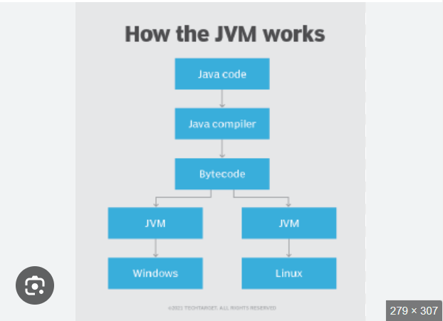
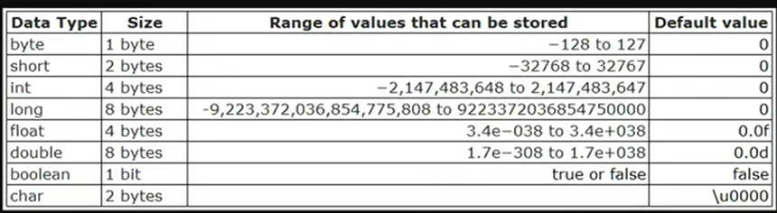
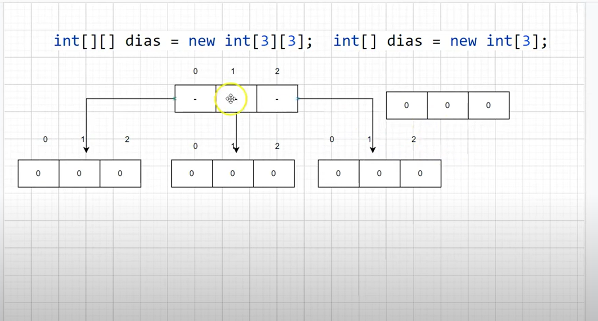
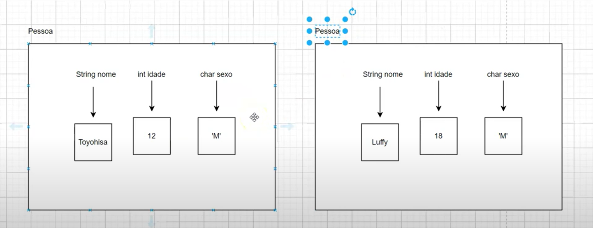

### Como funciona o java

O processo funciona basicamente quando é escrito um codigo java vem o compilador JAVAC e transforma o arquivo .java em um .class bytecode
que é oque o JVM(Java Virtual Machine) interpreta para o computador idependente do sistema operacional, ambos compilador e interpretador vem
no JDK.

- Pasta **"out"** na IDE: Aonde fi .clcam os arquivos compilados paraass em bytecode.

### Tipos primitivos

São tipos que irão guardar em memoria um valor simples      

O byte ocupa 1 byte de memória, ou seja, 8 bits. Em termos binários, 8 bits podem ser representados como 1111 1111, que equivale ao valor 255 em decimal ou FF em hexadecimal.

No entanto, como o tipo byte em Java é assinado (pode armazenar números negativos e positivos), a faixa de valores vai de -128 até 127. Isso ocorre porque a metade dos 256 possíveis valores (de 0 a 255) é usada para números negativos (de -128 a -1), enquanto a outra metade é usada para números positivos (de 0 a 127).

Portanto, o intervalo total é: -128 (valor mais baixo) a 127 (valor mais alto), somando-se os 256 valores possíveis no total.

String não é um tipo primitivo é uma classe.

 ### Operadores
##### Aritimeticos
+ Soma = "+"
+ Subtração = "-"
+ Multiplicação = "*"
+ Divisão = "/" 
+ %\
O resultado de uma operação de numeros inteiros sempre irão retornar numeros inteiros

##### Relacionais

< > <= >=  == !=

Retornam apenas valores booleanos

##### Operadores Logicos

+ &&(AND) ||(OR) !(NOT)

##### Operadores Atribuição
 
= += -= *= /= ++ --\
Adicionar o incrementador antes da variavel adiona o valor antes e após incrementa o valor que ela tem.

##### Estruturas Condicionais
Todos os valores dentro do if só sera executada ser for booleana, e true.
Todas a vezes que a primeira validadação do if for false ele executa o else.
Else if é uma validação intermediaria quando se tem mais de 2 opçoes.
            
Operador ternario

        //(condicao) ? verdadeiro : falso

##### Estruturas de Repetição

+ While
O valor de dentro sempre tem que ser um boolean e incrementado dentro do loop, se não roda infinito.
+ Do-While
Funciona como o while com a diferença que sempre será executado ao menos uma vez, e a verificação da condição é feita ao final do loop.
+ For
Todas a regras para fazer o loop são dadas no inicio, o valor incial do contador a verificação da condição e o incremento da variavel que roda o loop.

##### Arrays
Um array em Java é uma estrutura de dados que armazena uma sequência de valores do mesmo tipo e é uma variavel do tipo referencia.
É uma variável que armazena o endereço de um objeto na memória, em vez do próprio objeto.
Arrays são estaticos, após a inicialização dele ele sempre vai ter o mesmo numero de valores para preencher.
##### Arrays Multidimencionais
Arrays Multidimencionais são arrays dentro de arrays, int[ ][ ] dias = new int[2][2]
no exemplo de um array multidimencional teremos 3 arrays com 3 posições e cada array.

###### Garbage Collector
É Um mecanismo no Java que gerencia a memoria, reponsavel por liberar a memoria que não esta sendo mais referenciada no codigo.

### Orientação Objetos
##### Introdução classes

Orientação a objetos (POO) é um paradigma de programação que estrutura o código em torno de objetos que representam entidades do mundo real.
A POO permite: Modularizar o código, Reutilizar código, Desenvolver sistemas complexos, Aproximar o real e o virtual, Visualizar o que está sendo criado. 

A imagem acima representa a criação de dois objetos pessoas a partir de uma classe Pessoa, a classe é uma "forma" aonde é passa as caracteristicas
e atributos. Não possuem o psvm já que são classes de dominio, algo que representa o mapeamento do mundo real.
##### Coesão
Coesão em Java significa que cada classe deve ser responsável por um único objetivo, sem misturar funcionalidades de outras áreas. Isso torna o código mais organizado, claro e fácil de manter, pois cada classe tem uma função bem definida e focada em um único propósito.
##### Variaveis de referencia
Em Java, variáveis de referência armazenam o endereço de memória de um objeto, e não o objeto em si. Isso significa que elas apontam para a localização onde o objeto está armazenado, e qualquer alteração feita no objeto afetará todas as variáveis que referenciam esse mesmo objeto, já que todas compartilham o mesmo endereço de memória. Esses objetos são alocados na memória heap, que é a área destinada à alocação dinâmica de objetos durante a execução do programa. Quando você cria um objeto usando o operador new, ele é armazenado na heap, onde pode permanecer enquanto houver referências apontando para ele. A memória na heap pode crescer conforme necessário, e a gerência de memória dessa área é feita pelo garbage collector (coletor de lixo), que automaticamente libera a memória de objetos que não têm mais referências, evitando vazamentos de memória. A heap oferece flexibilidade e permite a alocação de objetos de tamanho variável, mas a sua administração é mais complexa em comparação com a memória da pilha.
##### Metodos
Métodos em Java são blocos de código dentro de uma classe que executam uma tarefa específica. Eles permitem que o código seja organizado e reutilizado, evitando a repetição de tarefas. Ao criar um método, você define um nome e um conjunto de instruções que serão executadas sempre que o método for chamado. Isso facilita a estruturação do programa, tornando-o mais modular e legível. Os métodos podem ser chamados de outras partes do código para realizar a funcionalidade que foi definida, ajudando a manter o programa mais limpo e eficiente.
+ Parâmetros\
Parâmetros são valores que você pode passar para um método quando o chama, permitindo que o método trabalhe com dados específicos. Eles são definidos na declaração do método e servem para fornecer informações que o método pode usar para realizar sua tarefa. Parâmetros tornam os métodos mais flexíveis, pois permitem que o mesmo método execute operações diferentes dependendo dos valores que são passados para ele. Em Java, os parâmetros podem ser de qualquer tipo de dado, incluindo tipos primitivos, objetos ou até mesmo arrays, e são importantes para a personalização do comportamento do método.
+ Retorno\
O return em Java é uma palavra-chave usada para finalizar a execução de um método e, opcionalmente, retornar um valor. Em métodos que retornam um valor (como int, String, etc.), o return deve ser seguido por uma expressão que corresponda ao tipo do valor esperado pelo método, como em return a + b;. Já em métodos void (que não retornam valor), o return pode ser utilizado apenas para finalizar o método antecipadamente, como em return;. Essa palavra-chave é essencial para controlar o fluxo de execução e para devolver resultados entre os métodos.
+ Parâmetros Tipos Primitivos\
Em Java, os parâmetros de tipos primitivos são passados por valor, ou seja, o valor da variável é copiado para o método, e qualquer alteração dentro do método não afeta a variável original. Os tipos primitivos incluem int, double, float, char, boolean, byte, short e long. Ao passar esses tipos como parâmetros, o método recebe uma cópia do valor, o que significa que alterações no método não impactam a variável original.
+ Parâmetros Tipos Referencia\
  Em Java, os parâmetros de tipo referência são usados para objetos e são passados por referência. Isso significa que, ao invés de copiar o valor do objeto, o método recebe uma referência para o objeto original, permitindo que qualquer alteração no objeto dentro do método afete o objeto original. Exemplos de tipos de referência incluem classes, arrays e interfaces. Como resultado, mudanças feitas em um objeto dentro de um método refletem diretamente no objeto passado como argumento.
+ Referência this\
  Em Java, a palavra-chave this refere-se à instância atual de uma classe, ou seja, ao objeto que invocou o método ou construtor. É comumente usada para diferenciar variáveis de instância de parâmetros ou outras variáveis locais com o mesmo nome. Também pode ser usada para chamar outros construtores da mesma classe. Exemplo: this.nome = nome; define o valor da variável de instância nome com o valor do parâmetro nome. O this é essencial para acessar membros da classe e evitar ambiguidade em casos de nomes semelhantes.
+ Varargs
  Em Java, varargs (argumentos variáveis) permitem passar um número variável de argumentos para um método, utilizando três pontos (...) antes do tipo do parâmetro. O varargs é tratado como um array dentro do método e deve ser o último parâmetro na lista. Ele facilita a passagem de múltiplos parâmetros sem a necessidade de sobrecarga de métodos ou criação manual de arrays. Por exemplo, você pode criar um método como imprimirNumeros(int... numeros), que pode ser chamado com qualquer número de argumentos, como imprimirNumeros(1, 2, 3) ou imprimirNumeros(), tornando o código mais flexível e conciso.
##### Modificador de acesso private, get e set
O modificador de acesso private em programação orientada a objetos é utilizado para restringir o acesso a atributos e métodos de uma classe, permitindo que esses membros sejam acessados apenas dentro da própria classe. Para acessar ou modificar esses atributos de fora da classe, é comum utilizar os métodos get e set. O método get permite recuperar o valor de um atributo privado, enquanto o set é utilizado para modificar esse valor. Essa prática garante o encapsulamento, proporcionando maior controle sobre os dados e a lógica de negócios da aplicação, além de evitar alterações inesperadas nos atributos diretamente.
##### Sobrecarga de Métodos
A sobrecarga de métodos em Java permite definir vários métodos com o mesmo nome, desde que tenham assinaturas diferentes (quantidade ou tipo de parâmetros). Além disso, um método sobrecarregado pode chamar outro método dentro da mesma classe, até mesmo com um nome diferente, permitindo reutilizar código e evitar repetições, tornando a implementação mais eficiente e organizada.
##### Contrutores
Quando um objeto é criado em Java, um construtor é sempre invocado para inicializá-lo. Se não houver um construtor explícito definido na classe, o Java automaticamente cria um construtor vazio, sem parâmetros, para garantir que o objeto seja inicializado com valores padrão. No entanto, se você definir um construtor com parâmetros, ele permite que o objeto seja criado com valores específicos passados no momento da instância. Nesse caso, o construtor vazio não é gerado automaticamente, e você precisará usar o construtor parametrizado para inicializar o objeto com dados personalizados. Portanto, dependendo da definição dos construtores, você pode controlar como os objetos são inicializados, seja de forma padrão ou com valores fornecidos.
A sobrec arga de construtor ocorre quando uma classe tem múltiplos construtores com o mesmo nome, mas com diferentes listas de parâmetros. Isso permite criar objetos de diferentes maneiras, dependendo dos parâmetros passados durante a criação. Por exemplo, uma classe pode ter um construtor sem parâmetros, outro com um parâmetro e até mesmo outro com múltiplos parâmetros, oferecendo flexibilidade na inicialização dos objetos. A sobrecarga de construtores é útil quando você deseja fornecer diferentes formas de inicializar um objeto, sem precisar criar múltiplos nomes para os construtores, simplificando o código e mantendo a clareza. O Java escolhe qual construtor usar com base nos tipos e na quantidade de argumentos fornecidos no momento da criação do objeto
##### Bloco de Inicialização
Existem dois tipos principais de blocos de inicialização em Java:

###### 1. Bloco de Inicialização de Instância

- **Quando é executado:** Sempre que um **objeto** da classe é criado.
- **Como funciona:** É executado **antes** do construtor, ou seja, logo após a criação do objeto e antes da execução do código do construtor.
- **Objetivo:** Inicializar variáveis de instância ou realizar outras operações que precisam ser feitas antes do construtor ser executado.

2. Bloco de Inicialização Estático

- **Quando é executado:** Apenas **uma vez**, quando a classe é carregada pela primeira vez pela JVM.
- **Como funciona:** É associado à **classe** e não a objetos individuais. É executado **antes** de qualquer instância da classe ser criada.
- **Objetivo:** Inicializar variáveis estáticas ou realizar operações que devem ocorrer uma única vez, como configurar recursos compartilhados ou fazer inicializações globais.

---

##### Resumo

- **Bloco de Inicialização de Instância:** Inicializa cada objeto individualmente e é executado toda vez que um novo objeto é criado.
- **Bloco de Inicialização Estático:** Inicializa a classe como um todo e é executado apenas uma vez, quando a classe é carregada.

##### Modificador `static` - Variáveis Estáticas

###### O que são variáveis estáticas?
Uma variável declarada como `static` pertence à classe em vez de pertencer a instâncias individuais. Isso significa que seu valor é compartilhado entre todas as instâncias da classe, e ela é inicializada apenas uma vez, na primeira utilização da classe.

###### Características das variáveis estáticas:
- São compartilhadas por todas as instâncias da classe.
- Podem ser acessadas diretamente pelo nome da classe (`Classe.variavel`).
- São inicializadas uma única vez, quando a classe é carregada na memória.
- Mantêm seu valor entre diferentes instâncias da classe.

###### Quando usar variáveis estáticas?
- Para definir constantes (`static final`), como `public static final double PI = 3.14;`
- Para contadores ou valores que devem ser compartilhados entre todas as instâncias da classe.
- Para cache de valores que não precisam ser recalculados repetidamente.

###### Observações
- O uso excessivo de variáveis estáticas pode tornar o código menos flexível e dificultar testes.
- Em aplicações multithread, deve-se ter cuidado ao modificar variáveis estáticas, pois elas podem ser acessadas simultaneamente por várias threads.

##### Métodos Estáticos

###### O que são Métodos Estáticos?
Os métodos estáticos pertencem à classe e não a uma instância específica da classe. Isso significa que eles podem ser chamados sem precisar criar um objeto.

###### Características dos Métodos Estáticos:
- São definidos com a palavra-chave `static`.
- Não podem acessar diretamente atributos de instância da classe.
- Só podem chamar outros métodos estáticos diretamente.
- São geralmente utilizados para operações que não dependem de instâncias específicas.

###### Quando Usar Métodos Estáticos?
- Para operações utilitárias (ex: `Math.pow()`, `Math.sqrt()`).
- Quando o método não depende de atributos de instância.
- Para criar fábricas de objetos (`factory methods`).
- Métodos auxiliares em classes de serviço.

###### Restrições dos Métodos Estáticos:
- Não podem usar `this` ou `super`, pois não pertencem a uma instância específica.
- Não podem ser sobrescritos (`override`), mas podem ser redefinidos em subclasses com um novo método estático.

###### Conclusão
Métodos estáticos são uma ferramenta poderosa para organizar código reutilizável e funções auxiliares. No entanto, devem ser usados com cautela para evitar dependências globais excessivas.

##### Associação